# Технологии хранения больших данных

Выполнили: Быковченко Софья Алексеевна, Мальцева Юлия Игоревна

Источник данных : Aviasales
# Лабораторная работа №1 “Работа с Airflow. ETL-процесс.”: 
В рамках данной работы вам необходимо реализовать ETL процесс, отвечающий за сбор и загрузку сырых данных в хранилище (слой ODS). База данных должна быть выбрана командой, выбор необходимо аргументировать. Оркестрация ETL процессов должна быть реализована с помощью Apache Airflow (https://airflow.apache.org/). 
## Этапы выполнения:
- [x] Развернуть сервис Airflow в Docker-контейнере, используя docker-compose 
конфигурацию (примеры можно найти в официальной документации, 
https://airflow.apache.org/docs/apache-airflow/stable/howto/docker-compose/index.html); 
- [x] Выбрать 3 различных сервиса для хранения данных. Например: s3, mongodb, 
oracle. Добавить конфигурацию для развертывания хранилищ в docker-compose. 
- [x] Реализовать не менее 3 различных ETL процессов (DAGов). При нехватке 
данных на одной платформе, данные можно брать с нескольких. Например: ozon + wildberries, aviasales + tutu.ru; Данные можно разделять логически в рамках одного источника: комментарии, товары, отзывы. 
- [x] В результате работы ETL процессов данные должны быть выгружены в выбранные базы данных; 
- [x] Провести сравнительный анализ выбранных хранилищ данных. Сравнительные критерии необходимо выбрать самостоятельно. Выбрать наиболее подходящее хранилище для полученных данных. 

Для защиты необходимо предоставить отчет, описывающий этапы выполнения работы, а также исходный код ETL процессов и docker-compose файл. 

Обязательным условием является демонстрация работы: веб интерфейс Airflow, выгруженные данные в базах данных, сравнительный анализ в виде графиков и/или таблиц.

## Отчёт

В данной лабораторной работе необходимо было реализовать ETL-процесс (Extract, Transform, Load ) для загрузки сырых данных в слой ODS (Operational Data Store)
с использованием Apache Airflow.

Для демонстрации ETL-процесса в качестве источника данных используется **API Aviasales**, предоставляемое через платформу Travelpayouts.

### Подготовка окружения
Перед началом реализации ETL-процессов была выполнена подготовка окружения.

1. Создание рабочей директории
2. Получение docker-compose.yaml. Официальный файл конфигурации Apache Airflow для Docker Compose был загружен из документации:
`curl -L "https://airflow.apache.org/docs/apache-airflow/2.7.3/docker-compose.yaml" -o docker-compose.yml`
3. Создан файл .env. Файл .env хранит переменные окружения для Airflow, упрощая настройку и переносимость системы.
`_PIP_ADDITIONAL_REQUIREMENTS` — дополнительные Python-библиотеки.
`AIRFLOW_UID` — UID пользователя контейнера для корректных прав на файлы.
4. В файл docker-compose.yml были добавлены три выбранных нами сервиса для реализации слоя ODS: `mongodb-ods`, `redis-ods`, `oracle-ods`
Также были добавлены соответствующие volumes для сохранения данных между перезапусками контейнеров: `mongodb_data:`, `redis_data:`, `oracle_data:`.
Эти тома обеспечивают сохранность данных в MongoDB, Redis и Oracle между перезапусками контейнеров.
5. Выполнена инициализация метаданных Airflow и создание учётной записи администратора: `docker-compose up airflow-init`
6. После успешной инициализации запущены все сервисы: `docker-compose up -d`
7. Веб-интерфейс Airflow стал доступен по адресу http://localhost:8080 (логин/пароль airflow/airflow)
8. Через личный кабинет Travelpayouts был получен API-токен, необходимый для запросов к данным Aviasales:
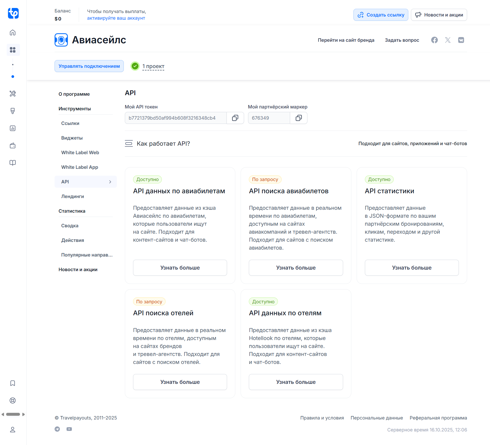
9.  Была успешно проверена работоспособность API на примитивных запросах.

### Реализация ETL-процессов
В рамках лабораторной работы было разработано три DAGа, каждый из которых реализует отдельный сценарий сбора и обработки данных из API Aviasales. 
Все DAGи следуют единой архитектуре Extract -> Transform -> Load, но работают с разными эндпоинтами API и решают разные задачи.

#### DAG 1. aviasales_cheap_tickets — сбор дешёвых билетов
Цель: получение актуальных предложений на самые дешёвые авиабилеты из Москвы (MOW) в популярные направления (Санкт-Петербург, Сочи, Новосибирск и др.) на октябрь 2025 года.

Источник:
`/aviasales/v3/grouped_prices` — возвращает сгруппированные по датам вылета предложения на билеты, найденные пользователями за последние 48 часов

***Этапы ETL:***
- extract - запрос к API для 8 направлений, извлечение данных о цене, авиакомпании, времени вылета, количестве пересадок
- transform - приведение типов, расчёт булевого флага `is_direct`, категоризация по цене (cheap/normal).
- load - одновременная загрузка в MongoDB, Redis и Oracle
  - MongoDB хранение полных JSON документов для гибкого анализа
  - Redis кэширование по ключу `ticket:{ticket_id}` для быстрого доступа
  - Oracle структурированное хранение в таблице `cheap_tickets` для SQL-запросов

DAG запускается каждые 6 часов, что позволяет отслеживать динамику цен

#### DAG 2. aviasales_popular_directions — анализ популярных направлений
Цель: получение данных о самых востребованных маршрутах из Москвы, основанных на статистике поисков пользователей Aviasales.

Источник:
`/v1/city-directions` — возвращает популярные направления с актуальными ценами и рейсами

***Этапы ETL:***
- extract - запрос для origin=MOW, получение списка направлений с ценами и рейсами
- transform - категоризация направлений по популярности (popular если цена < 15 000 руб), приведение типов
- load - загрузка в те же три хранилища, но в отдельные таблицы
  - MongoDB `popular_directions`
  - Redis ключи вида `direction:MOW:LED`
  - Oracle `popular_directions`

Эти данные помогают понять, какие направления наиболее востребованы, и могут использоваться для рекомендательных систем.

#### DAG 3. aviasales_price_trends — анализ цен по календарю
Цель: сбор динамики цен на билеты по дням в рамках одного месяца (октябрь 2025) для маршрута Москва - Санкт-Петербург.

Источник:
`/v1/prices/calendar` — возвращает цены на каждый день месяца

***Этапы ETL:***
- extract - запрос для маршрута MOW-LED, получение цены на каждый день октября
- transform - расчёт is_direct, категоризация по цене (cheap/normal), формирование уникального ticket_id
- load - загрузка в
  - MongoDB коллекция `price_trends`
  - Redis ключи `price_trend:{ticket_id}`
  - Oracle таблица `price_trends`

Позволяет строить графики изменения цен во времени и находить оптимальные даты для покупки билетов.

### MongoDB
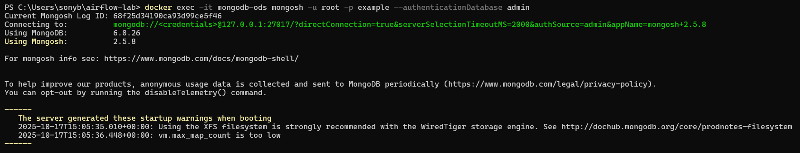
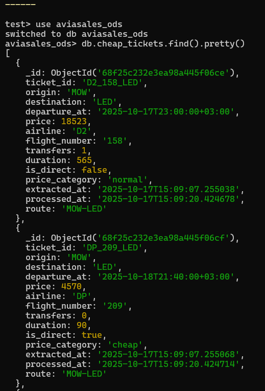
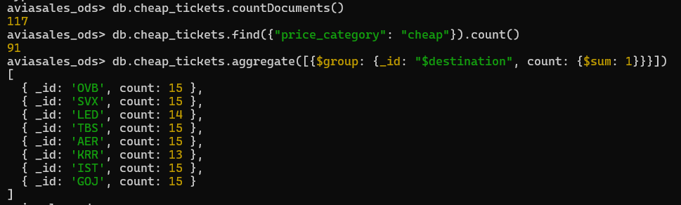

Подключение к MongoDB
`docker exec -it mongodb-ods mongosh -u root -p example --authenticationDatabase admin`

В MongoDB
- use aviasales_ods
- db.cheap_tickets.find().pretty()
- db.cheap_tickets.countDocuments()
- db.cheap_tickets.find({"price_category": "cheap"}).count()
- db.cheap_tickets.aggregate([{$group: {_id: "$destination", count: {$sum: 1}}}])

### Redis
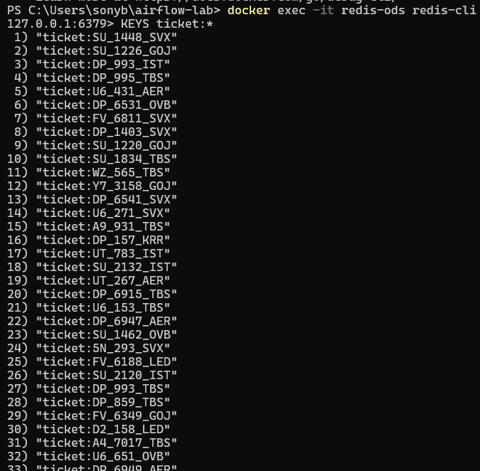
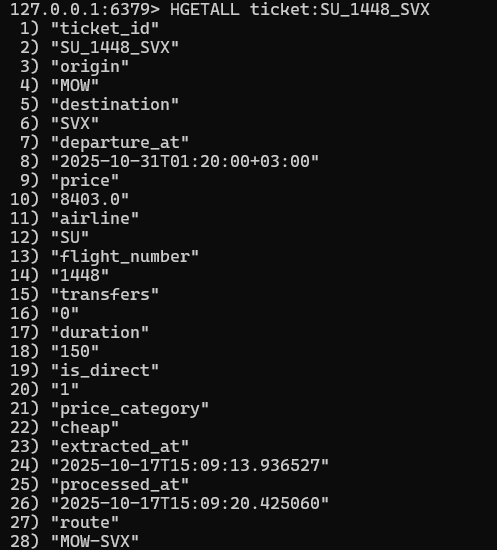
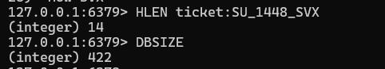

Подключение к Redis
`docker exec -it redis-ods redis-cli`

В Redis:
- KEYS ticket:*
- HGETALL ticket:SU_1448_SVX
- HLEN ticket:SU_1448_SVX
- DBSIZE

### Oracle
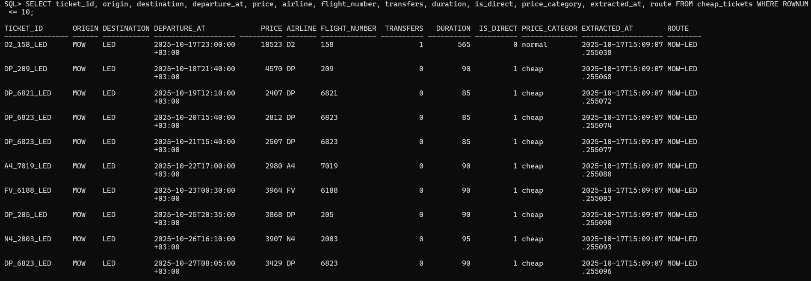
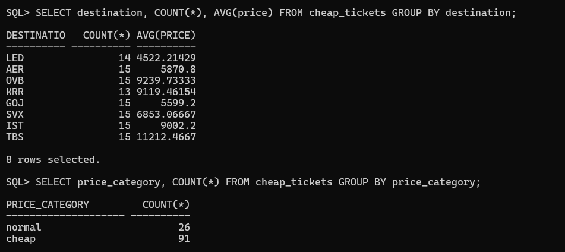

Подключение к Oracle
`docker exec -it oracle-ods sqlplus system/oracle@//localhost:1521/XEPDB1`

В Oracle:
- SELECT COUNT(*) FROM cheap_tickets;
- SET LINESIZE 200
SET PAGESIZE 50
COLUMN ticket_id FORMAT a15
COLUMN origin FORMAT a6
COLUMN destination FORMAT a11
COLUMN departure_at FORMAT a19
COLUMN airline FORMAT a7
COLUMN flight_number FORMAT a13
COLUMN price_category FORMAT a13
COLUMN extracted_at FORMAT a19
COLUMN route FORMAT a8
SELECT ticket_id, origin, destination, departure_at, price, airline, flight_number, transfers, duration, is_direct, price_category, extracted_at, route FROM cheap_tickets WHERE ROWNUM <= 10;
- SELECT destination, COUNT(*), AVG(price) FROM cheap_tickets GROUP BY destination; 
- SELECT price_category, COUNT(*) FROM cheap_tickets GROUP BY price_category;

### Сравнительный анализ выбранных хранилищ данных

Для сравнения выбранных хранилищ данных был разработан тестовый DAG. Наша цель была не просто измерить абстрактную производительность, 
а понять какая база данных лучше всего подходит для реальных задач нашей системы анализа авиаперелётов.

Были выбраны следующие критерии сравнения:
- **Производительность записи** отражает, насколько быстро система может сохранять новые данные. В нашем случае данные 
поступают из внешнего API Aviasales регулярно, большими порциями (ETL-процесс), поэтому скорость записи напрямую влияет 
на производительность всей системы.
- **Производительность чтения**. Хранилище активно используется для выборок (получение билетов, направлений и трендов).
Высокая скорость чтения нужна при обращении клиентских приложений и при формировании отчётов в Airflow.
- **Аналитические возможности**. После загрузки данных требуется их обработка и анализ (например фильтрация по цене или направлению).
Значит для нас важно оценить может ли база данных выполнять сложные запросы и агрегировать данные без дополнительной обработки на стороне приложения.

Мы создали тестовые данные — 500 записей об авиабилетах с разными ценами, авиакомпаниями и условиями перелётов. 
Для каждой базы данных выполнили одинаковые операции
- массовую вставку данных
- затем поиск по условию (билеты дешевле 8000 рублей)
- везде замеряли время выполнения

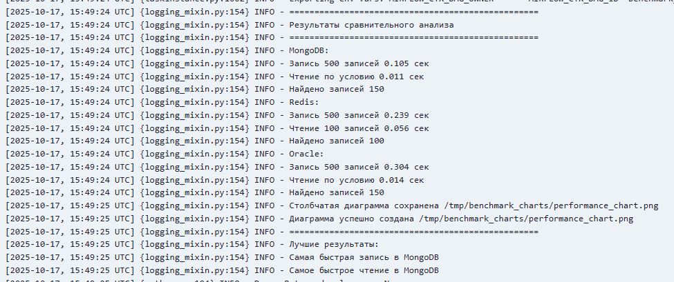

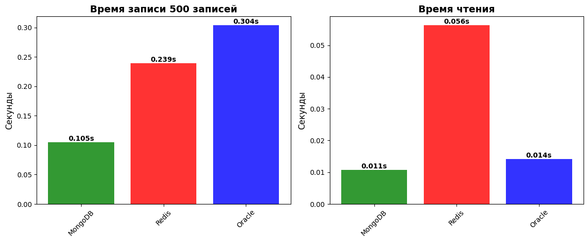

#### Вывод по результатам анализа
`MongoDB` показала лучшие результаты по скорости записи и чтения, а также обладает достаточными аналитическими возможностями.
Запись 500 билетов всего за 0.105 секунды (почти в 3 раза быстрее Oracle). 
При этом она не пожертвовала функциональностью ради скорости. Быстро находит 150 билетов по цене за 0.011 секунды, фильтрует по авиакомпаниям и другим параметрам. 

`Redis` оказался неэффективным для пакетной записи и не поддерживает сложные запросы, поэтому подходит лишь для кэширования.
Запись данных заняла 0.239 секунды, что медленнее MongoDB. Но главная проблема в ограниченной функциональности. 
Redis не умеет выполнять поиск по условиям типа "найти все билеты дешевле 8000 рублей". Он может только читать заранее известные записи по их ID (100 записей за 0.056 секунды). 
Это делает его не очень полезным для аналитики, но хорошим вариантом для кэширования часто запрашиваемых маршрутов.

`Oracle` имеет хорошие аналитические возможности, но проигрывает по скорости записи. 
Она так же успешно, как и MongoDB, справляется со сложными запросами и находит нужные данные (150 записей за 0.014 секунды). 
Однако запись данных в Oracle занимает 0.304 секунды. Почти в 3 раза больше времени, чем в MongoDB. Для системы, где цены на билеты обновляются постоянно, 
такая медлительность становится недостатком. Oracle подходит для глубокого анализа, но не для оперативной работы с постоянно меняющимися данными.

#### Итоговое решение
Для хранения и обработки данных, получаемых из API Aviasales, наиболее подходящим хранилищем является MongoDB. 
Оно сочетает в себе высокую производительность и простоту интеграции в ETL-процесс.

---
# Лабораторная работа №2 “Нормализация данных. DataQuality.”

Разработка базового аналитического хранилища данных на основе сырых данных из ЛР1. Формирование процессов очистки, трансформации и загрузки данных в слой DDS.

## Этапы выполнения:

- [ ] Определить структуру хранилища: схема "звезда" или "снежинка". Привести данные к 3НФ. 
  - Пример сущностей для DDS: 
    - Факты: продажи, комментарии, активность пользователей, 
    - Измерения: товары, пользователи, даты, категории;
  - В некоторых источниках данных может возникнуть проблема с выбором подходящей сущности для фактов. При возникновении такой ситуации достаточно нормализовать данные. 
- [ ] Создать новые DAG в Airflow для трансформации данных:
  - DDS-слой: Скрипты очистки (удаление дубликатов, приведение типов), обогащение, агрегация; 
- [ ] Где возможно, сущности должны соответствовать концепции медленно изменяющихся измерений (SCD), чтобы изменения значений атрибутов 
сущностей могли отслеживаться во времени; 
- [ ] Построение зависимостей между ETL-процессами. Процессы детального слоя должны ожидать завершения соответствующих расчетов исходных данных. 
Для реализации зависимостей возможно использовать сенсоры (https://airflow.apache.org/docs/apache-airflow/stable/core-concepts/sensors.html). 
Альтернативные варианты приветствуются. 
- [ ] Data Quality: реализовать DAG для проверки качества данных. 
  - Примеры возможных проверок:
    - Сравнить объемы данных до/после трансформации, 
    - Проверить отсутствие аномальных значений в атрибутах.  

## Отчёт

В ЛР1 были реализованы три DAGа на основе API Aviasales:

- aviasales_cheap_tickets — дешёвые билеты,
- aviasales_popular_directions — популярные маршруты,
- aviasales_price_trends — динамика цен по дням.

Все данные загружались в ODS в Oracle в виде плоских таблиц (cheap_tickets, popular_directions, price_trends).
Для ЛР2 используется таблица cheap_tickets, содержащая 128 записей о билетах с атрибутами:
ticket_id, origin, destination, departure_at, price, airline, transfers, duration и др.

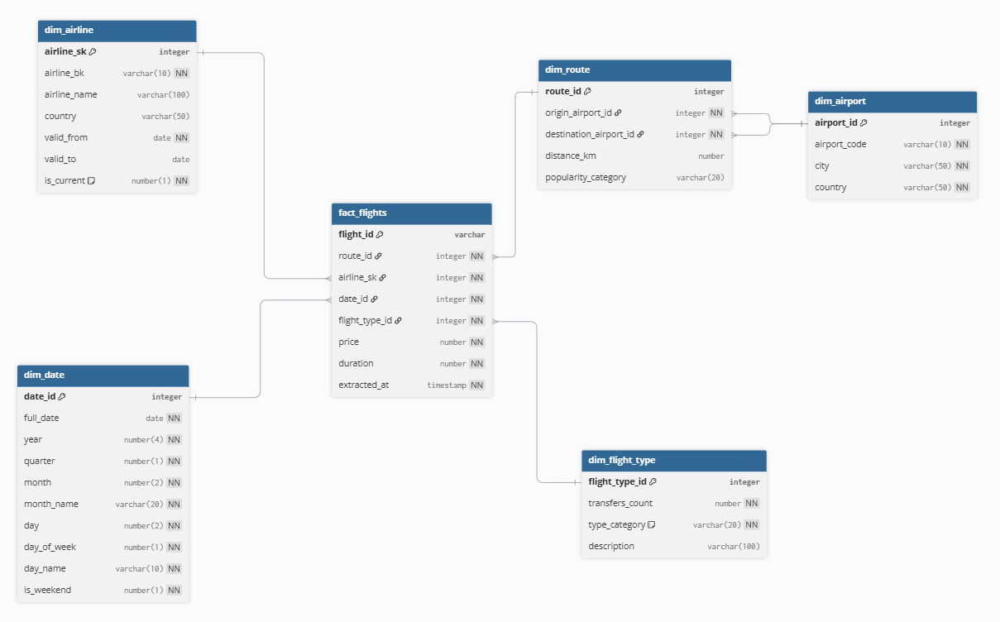

### Выбор модели данных

Для построения аналитического слоя DDS мы выбрали схему «Звезда» по следующим причинам:

1. В схеме «Звезда» факт-таблица напрямую связана с измерениями, без промежуточных таблиц. Это упрощает SQL-запросы и повышает производительность при агрегации (например, «средняя цена билета по направлениям»).
2. Данные о рейсах имеют чёткую структуру «событие -> атрибуты»: каждый факт — это конкретный найденный билет, а атрибуты — маршрут, авиакомпания, дата, цена. Это хорошо ложится на данный тип модели.

Наша «Звезда» состоит из:
- Одной факт-таблицы: fact_flights — события (найденные билеты),
- Четырёх измерений:
  - dim_route — маршрут (origin/destination)
  - dim_airline — авиакомпания
  - dim_date — календарная дата
  - dim_aircraft_type — тип перелёта (прямой/с пересадками).

### Нормализация до 3НФ

- 1НФ: все атрибуты атомарны (например, departure_at разделён на date_id и временные компоненты в dim_date)
- 2НФ: устранены частичные зависимости (все атрибуты зависят от полного первичного ключа)
- 3НФ: устранены транзитивные зависимости (например, в dim_date — date_id -> full_date -> year/month -> разнесено в отдельные столбцы, зависящие только от date_id).

Например, в dim_airline информация об авиакомпании хранится в одном месте (устранено дублирование из cheap_tickets), 
в dim_route маршрут кодируется один раз, а не повторяется в каждой записи.

### Реализация ETL-процессов

#### Создание измерений (`dds_dimensions.py`)
Реализованы задачи:
- create_dim_date — генерация календаря на период 2020–2025 (2192 записей),
- create_dim_airline — справочник из 10 авиакомпаний,
- create_dim_route — маршруты, обогащённые названиями городов (на основе cheap_tickets),
- create_dim_flight_type — типы перелётов по количеству пересадок.

#### Реализация SCD Type 2 (`dds_airline_scd2.py`)
Для демонстрации поддержки истории изменений реализован медленно изменяющийся тип измерения (SCD Type 2) для авиакомпаний

Атрибуты: airline_sk (surrogate key), airline_bk (business key = код), valid_from, valid_to, is_current.

При изменении названия или страны — закрывается старая версия (valid_to = NOW, is_current = 0) и создаётся новая.

Это позволяет сохранять историческую корректность аналитики. Факт всегда ссылается на версию измерения, актуальную на момент загрузки.

#### Загрузка фактов (`dds_fact_flights.py`)
Процесс включает очистку таблицы fact_flights, парсинг дат, сопоставление с измерениями (
`route_id — по origin/destination`, `airline_sk — по airline_bk с фильтром is_current = 1`,
`date_id — из departure_at`, `aircraft_type_id — по количеству transfers`), вставку записей.

### Управление зависимостями между ETL-процессами
Для обеспечения корректной и надёжной последовательности выполнения этапов загрузки данных были разработаны два координирующих DAG с разными подходами к управлению зависимостями.

#### DAG `dds_coordinator_triggers.py`
Простая реализация с использованием только `TriggerDagRunOperator` для последовательного запуска:
- Параллельная загрузка исходных данных (aviasales_cheap_tickets, aviasales_popular_directions, aviasales_price_trends)
- Создание измерений с SCD2 (dds_airline_scd2)
- Создание остальных измерений (dds_dimensions)
- Загрузка фактов (dds_fact_flights)
- Проверка качества данных (data_quality_checks)

#### DAG `dds_coordinator_sensors.py` - основной координатор
Продвинутая реализация с использованием сенсоров для точного контроля внутренних зависимостей:

**Архитектура координатора:**
- Начинает работу с отладки доступности целевых DAGов через `debug_dag_status`
- **Параллельно запускает** создание измерений:
  - `dds_airline_scd2` - справочник авиакомпаний с поддержкой SCD Type 2
  - `dds_dimensions` - остальные измерения (dim_date, dim_route, dim_flight_type)

**Цепочка выполнения с контролем зависимостей:**
1. **Параллельное создание измерений** с ожиданием завершения через сенсоры:
   - `wait_airline_scd2_complete` - ожидает завершения `validate_dim_airline_data`
   - `wait_dimensions_complete` - ожидает завершения `check_dimension_data`

2. **Загрузка фактов** только после готовности всех измерений:
   - `trigger_fact_flights` запускается после завершения ВСЕХ сенсоров измерений
   - `wait_facts_complete` ожидает завершения `validate_fact_flights_data`

3. **Финальная проверка качества**:
   - `trigger_quality_checks` выполняется после успешной загрузки фактов

**Преимущества подхода с сенсорами:**
- Параллельное выполнение независимых задач (создание разных измерений)
- Точечный контроль завершения конкретных задач (не просто DAG, а конкретных task)
- Автоматическое повторение при неудаче зависимых задач
- Гибкая настройка времени ожидания (timeout=3600, poke_interval=30)
- Режим `reschedule` для эффективного использования ресурсов

### Проверка качества данных (`data_quality_checks.py`)
После загрузки данных в слой DDS выполняется комплексная проверка качества:

#### Проверяемые аспекты:
- **Объём данных**: ODS — 128 записей, DDS — 66 записей
  - Снижение объясняется фильтрацией только билетов из Москвы и исключением дубликатов или некорректных записей
- **Валидность**: Нет аномальных цен (price ≤ 0 или > 1 000 000) — 0 записей
- **Целостность**: Все внешние ключи (route_id, airline_sk, date_id) заполнены — 0 NULL-значений

#### Дополнительные проверки:
- Статистика по авиакомпаниям (количество рейсов, средняя цена)
- Анализ типов перелётов (распределение прямых/с пересадками)
- Покрытие дат (диапазон и уникальные даты)

### Реализованные DAGs

1. **`dds_dimensions.py`** - создание измерений
2. **`dds_airline_scd2.py`** - SCD Type 2 для авиакомпаний  
3. **`dds_fact_flights.py`** - загрузка факт-таблицы
4. **`data_quality_checks.py`** - проверка качества данных
5. **`dds_coordinator_triggers.py`** - координация через триггеры
6. **`dds_coordinator_sensors.py`** - координация через сенсоры

### Результаты

Успешно реализовано аналитическое хранилище данных с поддержкой:
- Нормализованной структуры (3НФ) в схеме "звезда"
- Медленно изменяющихся измерений (SCD Type 2)
- Автоматизированных ETL процессов с контролем зависимостей
- Комплексной системы проверки качества данных

Все процессы работают корректно и обеспечивают надежную загрузку данных из ODS в DDS слой с сохранением целостности и качества данных.
